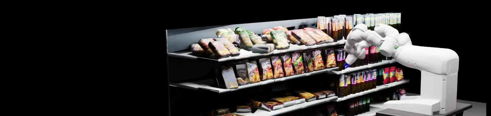

# **Work in progress**

This project is still under active development and is not yet fully functioning end to end. It currently requires an NVIDIA GPU and a working NVIDIA container runtime.



# IsaacSim Store Shelf

ROS 2 Isaac Sim + MoveIt/cuMotion pipeline for dual-arm YuMi shelf picking, with vision-driven target selection and direct trajectory execution.

I built it to learn the modern Isaac Sim and ROS 2 manipulation stack, push cuMotion toward coordinated multi-arm planning, and explore how simulation, perception, and motion planning fit together in one system.

## Components

- `docker-compose.yml`, `Dockerfile.ros2`, `Dockerfile.isaacsim`
  - Uses **Docker Compose** with GPU passthrough via `gpus: all`, `/dev/dri`, `NVIDIA_VISIBLE_DEVICES=all`, and `NVIDIA_DRIVER_CAPABILITIES=all`.
  - Defines a **ROS 2 Jazzy** service for workspace builds, training, inference, MoveIt, cuMotion, and launch orchestration.
  - Defines an **Isaac Sim 5.1.0** service that runs the simulation manager with the Isaac Sim Python runtime.
  - Supports **headed** and **headless** Isaac Sim startup through manager commands and launch arguments.
  - Mounts Isaac Sim cache, config, logs, and app data into repo-local `.docker/isaacsim` directories.

- `src/isaacsim_manager`
  - Uses **Isaac Sim**, **USD**, **PhysX**, and the **Isaac Sim ROS 2 bridge** to construct and run the shelf scene.
  - `manager.py` exposes a ROS control interface on `/isaacsim_manager/control` and supports `start`, `start_headless`, `stop`, and `restart`.
  - `scene_construction.py` loads the shelf USD, imports the YuMi **URDF**, adds camera frames, TF graphs, ROS camera output, static colliders, item semantics, and drop-off targets.
  - `image_collection.py` defines the `collect_vision_data`, `static`, and `store_demo` scenarios.
  - Uses **Omniverse Replicator** to capture RGB, instance segmentation, distance-to-camera, and per-frame metadata for vision training.
  - `trajectory_executor.py` implements direct **FollowJointTrajectory** action servers that apply planned joint trajectories to Isaac Sim articulations.
  - `vision_panel.py` and `target_marker_visualizer.py` add in-simulation debug views for model output and selected pick targets.

- `src/vision`
  - Uses **PyTorch**, **torchvision**, **OpenCV**, and **ROS 2 image topics** for training and inference.
  - Input is camera RGB from `/camera/image_raw` plus `/camera/camera_info`; training data comes from Replicator RGB, instance segmentation, distance-to-camera, and metadata files.
  - Output includes `/vision/debug_image`, `/vision/predicted_identity`, `/vision/predicted_depth`, `/vision/predicted_depth_viz`, `/vision/predicted_occupancy`, `/vision/selected_item_point`, and `/vision/selected_item_moveit_point`.
  - The model is a custom **query-based depth and identity predictor**.
  - The backbone is **MobileNetV3 Small** feature extraction followed by a 1x1 projection, learned object queries, a **Transformer decoder**, slot heads, and small alpha-mask patch decoders.
  - Inference chooses a visible item query, estimates a 3D camera-space point from predicted depth and camera intrinsics, then transforms it into world and MoveIt frames with **tf2**.

- `src/motion`
  - Uses **ROS 2**, **MoveIt 2**, **NVIDIA Isaac ROS cuMotion**, and action-based trajectory execution.
  - `coordinator.py` receives selected item points, assigns targets to the left or right arm, and sequences pick steps: pregrasp, grasp, close gripper, retract, move to drop, open gripper.
  - `planner.py` converts assigned targets into MoveIt pose goals, sends requests to MoveGroup, publishes planned trajectories for peer-arm collision awareness, and can execute through direct Isaac Sim trajectory actions.
  - `occupancy.py` builds collision context from the other arm and planned peer trajectories.
  - `cumotion_sphere_publisher.py` publishes cuMotion robot spheres for RViz debugging against the visible robot mesh.

- `src/yumi_description`
  - Uses **Xacro** as the canonical robot description source.
  - `export_isaacsim_urdf` generates the Isaac-ready YuMi **URDF** used by the simulator.
  - Keeps MoveIt and Isaac Sim derived from one robot description instead of separate hand-maintained models.

- `src/yumi_moveit_config`
  - Contains **MoveIt 2** configuration for the YuMi arms, including SRDF, joint limits, kinematics, controllers, planning pipelines, and cuMotion configuration.
  - `static_planning_scene.py` publishes shelf collision objects into MoveIt and retries if the planning scene service rejects the first application.
  - RViz config `rviz/cumotion_debug.rviz` visualizes the robot, cuMotion spheres, attached objects, and voxel/debug topics.

- `src/controller`
  - Provides top-level **ROS 2 launch orchestration**.
  - `store_demo.launch.py` starts the Isaac Sim scenario, vision inference, motion coordinator/planners, MoveIt, ros2_control, and optional RViz.
  - `collect_vision_data.launch.py` starts the synthetic data capture scenario.
  - `static.launch.py` starts a lighter static visualization/debug setup.

## How to run

Create Isaac Sim writable cache directories once:

```bash
mkdir -p .docker/isaacsim/cache/main .docker/isaacsim/cache/computecache .docker/isaacsim/logs .docker/isaacsim/config .docker/isaacsim/data .docker/isaacsim/pkg
sudo chown -R 1234:1234 .docker/isaacsim
```

Allow local X11 access for headed Isaac Sim on Linux:

```bash
xhost +local:
```

Build the containers:

```bash
COMPOSE_PARALLEL_LIMIT=1 docker compose build ros2 isaacsim
```

Start the Isaac Sim manager service:

```bash
docker compose up isaacsim
```

In another terminal, build and source the ROS workspace:

```bash
docker compose run --rm ros2 bash
source /opt/ros/jazzy/setup.bash
source /opt/isaac_ros_cumotion_ws/install/setup.bash
source /opt/isaac_manipulator_ws/install/setup.bash
colcon build --symlink-install
source install/setup.bash
```

Run the full store demo with cuMotion:

```bash
ros2 launch controller store_demo.launch.py \
  motion_pipeline_id:=isaac_ros_cumotion \
  motion_planner_id:=cuMotion
```

Run the same demo with RViz MoveIt/cuMotion debugging:

```bash
ros2 launch controller store_demo.launch.py \
  motion_pipeline_id:=isaac_ros_cumotion \
  motion_planner_id:=cuMotion \
  use_moveit_rviz:=true
```

Start the simulation in headless mode through the lower-level launch path:

```bash
ros2 launch controller sim.launch.py \
  headless:=true \
  configuration:=store_demo \
  use_moveit:=true \
  planning_pipeline:=isaac_ros_cumotion
```

Collect synthetic vision training data:

```bash
ros2 launch controller collect_vision_data.launch.py headless:=true
```

Train the vision model:

```bash
ros2 launch controller train_vision.launch.py
```

Run vision inference only:

```bash
ros2 launch vision inference.launch.py \
  checkpoint_dir:=/workspace/checkpoints/vision \
  image_topic:=/camera/image_raw
```

Export the Isaac Sim **URDF** after robot description changes:

```bash
ros2 run yumi_description export_isaacsim_urdf
```

## Credits and licenses

- Supermarket Potato Chips Shelf Asset
  - Author: **Rendevr**
  - License: **CC Attribution**
  - Source: https://sketchfab.com/3d-models/supermarket-potato-chips-shelf-asset-4e4ccc3074f0474bbfa23611c46a4029

- ABB YuMi robot assets
  - Upstream source: https://github.com/OrebroUniversity/yumi
  - Canonical local robot package: `src/yumi_description`
  - License: BSD-2-Clause-style text in `src/yumi_description/LICENSE`

- NVIDIA and ROS ecosystem
  - Uses **NVIDIA Isaac Sim**, **Omniverse Replicator**, **Isaac ROS cuMotion**, **ROS 2 Jazzy**, **MoveIt 2**, **ros2_control**, and **RViz**.
